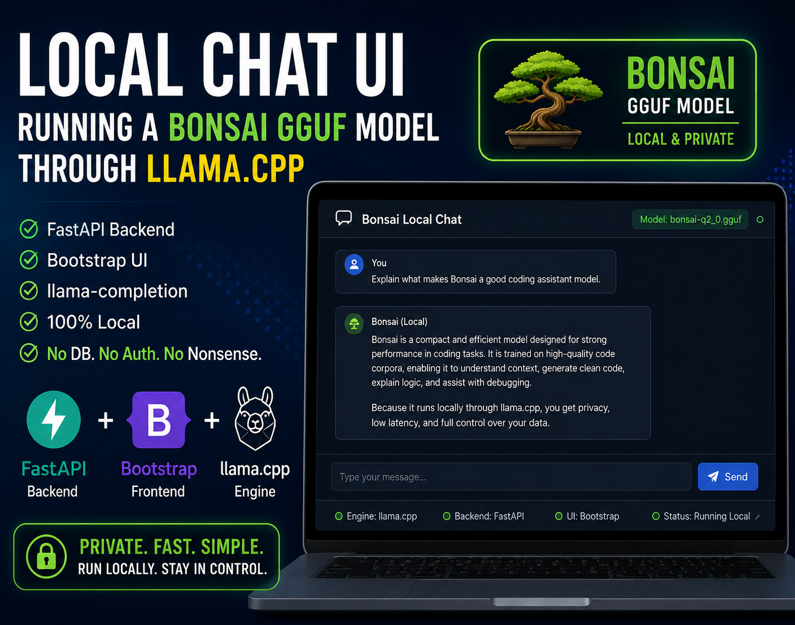

# Bonsai Llama

<p align="center">
  
  
  
  
</p>


Small local chat UI for running a Bonsai GGUF model through `llama.cpp` using:

- `FastAPI` for the backend
- `Bootstrap` for a clean browser UI
- `llama-completion` for text generation

This repo is intentionally simple. No database. No auth. No orchestration layer trying to earn a promotion. Just a practical app that takes a prompt, runs a local model, and sends the answer back to the browser.

## Preview



The README also includes a lightweight banner graphic for a cleaner first impression, but this screenshot is the real app in action.

```md

```

## Why Bonsai?

The Bonsai model is a nice fit for a local playground because it aims for a useful balance:

- Small enough to experiment with locally
- Fast enough to feel interactive
- Good enough to draft, explain, summarize, and riff
- GGUF format makes it easy to use with `llama.cpp`

For this project, Bonsai is a strong choice because the goal is not "largest model wins." The goal is "open the browser, type something, get a response, keep moving."

## How It Works

```text
Browser UI
   |
   v
FastAPI app (`app.main:app`)
   |
   v
subprocess -> llama-completion
   |
   v
GGUF model in ../models
```

The app:

1. Lists available `.gguf` files from the models directory
2. Renders them in a dropdown
3. Accepts prompt + generation parameters from the UI
4. Calls `llama-completion` with those parameters
5. Returns plain text output to the browser

## Project Structure

```text
bonsai-llama/
├── app/
│   ├── main.py
│   └── templates/
│       └── index.html
├── requirements.txt
├── .gitignore
└── README.md
```

This repo expects these sibling paths by default:

```text
zoneone/
├── bonsai-llama/
├── llama.cpp/
└── models/
```

## Requirements

- Python 3.11+
- A built `llama.cpp` checkout
- A GGUF model in `../models`

Expected binary path:

```text
../llama.cpp/build/bin/llama-completion
```

Expected model path:

```text
../models/*.gguf
```

## Clone And Run

### 1. Clone the repo

```bash
git clone <your-repo-url>
cd bonsai-llama
```

### 2. Create a virtual environment

```bash
python3 -m venv .venv
```

### 3. Install dependencies

```bash
.venv/bin/pip install -r requirements.txt
```

### 4. Start the app

```bash
.venv/bin/uvicorn app.main:app --host 127.0.0.1 --port 8000 --reload
```

### 5. Open it

```text
http://127.0.0.1:8000
```

## Runtime Configuration

You can override the default sibling-path setup with environment variables:

```bash
export BONSAI_LLAMA_COMPLETION="/absolute/path/to/llama-completion"
export BONSAI_MODEL_DIR="/absolute/path/to/models"
```

Then run:

```bash
.venv/bin/uvicorn app.main:app --host 127.0.0.1 --port 8000 --reload
```

## Default Settings

The UI exposes:

- Model
- Tokens
- Temperature
- Top P
- Top K
- GPU Layers

Recommended first-run values:

- Tokens: `300`
- Temperature: `0.5`
- Top P: `0.9`
- Top K: `30`
- GPU Layers: `0`

Starting with `GPU Layers = 0` keeps things calm while you validate the flow. Once the app is stable on your machine, you can experiment upward with higher GPU layer counts like 99.


## What To Add Next

Good next upgrades for this repo:

- Streaming token output to the browser
- Chat history with multi-turn context
- System prompt support
- Presets for coding, summarization, and brainstorming
- Markdown rendering for responses
- Copy button for outputs
- Request cancellation button
- Basic prompt templates
- Docker support
- A proper demo GIF in `docs/`

## Why This Repo Is Nice To Push

- Small and understandable
- No model weights committed
- No giant build directory committed
- Clear setup steps
- Easy for someone else to clone and run

That means your GitHub repo can stay clean, fast to review, and friendly to future-you.

## Notes

- This project uses `llama-completion`, not `llama-cli`
- It is designed for local usage
- Model speed depends heavily on your hardware and model size


## Useful Commands

### Create virtual environment

```bash
python3 -m venv .venv
```

### Install dependencies

```bash
.venv/bin/pip install -r requirements.txt
```

### Start development server

```bash
.venv/bin/uvicorn app.main:app --host 127.0.0.1 --port 8000 --reload
```

### Open the app

```bash
open http://127.0.0.1:8000
```

### Run with custom model directory

```bash
BONSAI_MODEL_DIR="/absolute/path/to/models" .venv/bin/uvicorn app.main:app --host 127.0.0.1 --port 8000 --reload
```

### Run with custom llama-completion binary

```bash
BONSAI_LLAMA_COMPLETION="/absolute/path/to/llama-completion" .venv/bin/uvicorn app.main:app --host 127.0.0.1 --port 8000 --reload
```

### Check what is using port 8000

```bash
lsof -nP -iTCP:8000 -sTCP:LISTEN
```

### Stop a local server by PID

```bash
kill <PID>
```

### Force stop a stuck local server

```bash
kill -9 <PID>
```

### Verify the llama.cpp binary exists

```bash
ls -la ../llama.cpp/build/bin/llama-completion
```

### Verify available models

```bash
ls -la ../models
```

### Quick syntax check for the backend

```bash
python3 -m py_compile app/main.py
```

### See live server logs in the terminal

```bash
.venv/bin/uvicorn app.main:app --host 127.0.0.1 --port 8000 --reload
```

Then watch for lines like:

```text
Running command: /path/to/llama-completion ...
```


## 📩 Contact

| Name              | Details                             |
|-------------------|-------------------------------------|
| **👨‍💻 Developer**  | Sachin Arora                      |
| **📧 Email**      | [sachnaror@gmail.com](mailto:sacinaror@gmail.com) |
| **📍 Location**   | Noida, India                       |
| **📂 GitHub**     | [Link](https://github.com/sachnaror) |
| **🌐 Youtube**    | [Link](https://www.youtube.com/@sachnaror4841/videos) |
| **🌐 Blog**       | [Link](https://medium.com/@schnaror) |
| **🌐 Website**    | [Link](https://about.me/sachin-arora) |
| **🌐 Twitter**    | [Link](https://twitter.com/sachinhep) |
| **📱 Phone**      | [+91 9560330483](tel:+919560330483) |

